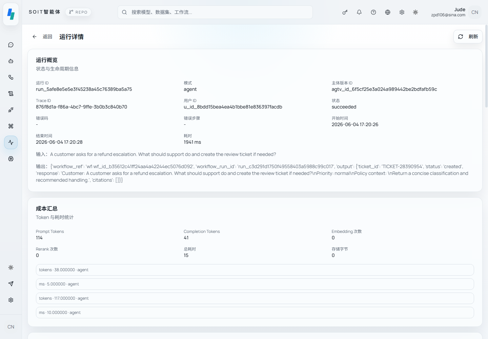

<div align="center">
  <h1>SOIT</h1>

  <p><strong>面向企业 AI 系统的可治理 Agent Runtime。</strong></p>

  <p>
    <code>Build</code> &nbsp;·&nbsp; <code>Govern</code> &nbsp;·&nbsp; <code>Execute</code> &nbsp;·&nbsp; <code>Observe</code>
  </p>

  <p>
    <a href="./LICENSE"></a>
    <a href="https://github.com/soit-ai/soit/actions/workflows/quality.yml"></a>
    <a href="https://github.com/soit-ai/soit/actions/workflows/security.yml"></a>
    <a href="https://github.com/soit-ai/soit/releases"></a>
    <a href="./CHANGELOG.md"></a>
  </p>

  <p>
    <a href="#快速开始">快速开始</a> &nbsp;·&nbsp;
    <a href="#架构">架构</a> &nbsp;·&nbsp;
    <a href="./docs/quickstart.zh-CN.md">文档</a> &nbsp;·&nbsp;
    <a href="#路线图">路线图</a> &nbsp;·&nbsp;
    <a href="./CHANGELOG.md">更新日志</a> &nbsp;·&nbsp;
    <a href="./CONTRIBUTING.md">贡献指南</a> &nbsp;·&nbsp;
    <a href="./README.md">English</a>
  </p>
</div>

<br />

<p align="center">
  
</p>

<br />

## SOIT 是什么？

SOIT Community 是开源的 **Agent Runtime and Governance Platform**，面向已经验证了 Agent 价值、现在需要让 Agent 接入真实企业系统而又不失控的团队。它把 Agent 构建、工作流执行、知识检索、工具/MCP 接入、模型路由和运行时观测收敛到一个自托管控制平面，并附带企业在让 Agent 触碰敏感数据和系统之前所需要的治理层。

产品的核心切入点是受治理的执行：每一次 Agent 运行都受权限约束、绑定到已批准的能力、受密钥边界保护、受外联策略限制、经运行时账本追踪、归因成本、记入审计日志，并可通过回放检查。

**已经在自己的代码里直接调用模型？** SOIT 同时在 `/v1` 下提供 OpenAI 兼容接口。把 OpenAI SDK、LangChain 或 OpenAI Agents SDK 指向它，换用 SOIT API Key，每次调用就成为一次受治理的运行：按 Key 的限流、配额、地址与模型白名单，超出即停的预算，不落内容的运行，审计，成本归因，以及通过虚拟模型在多个服务商之间故障切换，应用代码无需改动。详见[网关指南](./docs/gateway.md)和[接入示例](./examples/gateway/)。同一把 Key 还能直接调用工作区里受治理的工具（`/api/v1/tools`），或者从 Claude Code、Cursor 等任意 MCP 客户端调用（`/mcp`，见 [SOIT 作为 MCP server](./docs/mcp.md)）；[`soit` 命令行](./cli/)可以运行 Agent、在新模型上回放回归集并导出证据。

SOIT 不打算成为又一个轻量级聊天机器人构建器。它服务的是那些已经证明 Agent 有用、现在需要权限、密钥、外联网络控制、可审计性、成本问责、可追踪性和回放，才能把 Agent 放进生产工作流的团队。

## 为什么选择 SOIT？

|                          | Notebook 框架 | 托管 Agent 产品 | 云厂商 Agent | **SOIT**       |
| ------------------------ | :-----------: | :-------------: | :----------: | :------------: |
| 多租户隔离               | —             | 部分            | 有           | **一等公民**   |
| 模型中立的路由           | 有            | 部分            | 绑定厂商     | **一等公民**   |
| Workflow + Agent 双模型  | 部分          | 二选一          | 部分         | **两者并重**   |
| 可审计的执行账本         | —             | 部分            | 部分         | **内置**       |
| 权限与密钥边界           | 手工          | 部分            | 云原生       | **内置**       |
| 外联控制                 | 手工          | 部分            | 云原生       | **策略驱动**   |
| 成本、追踪与回放证据     | 手工          | 部分            | 部分         | **运行时原生** |
| 自托管、一条命令         | 有            | —               | —            | **有**         |
| Spec-first 契约          | —             | —               | —            | **每个原语**   |

SOIT 是我们当年把 Agent 从 notebook 搬进生产时希望自己手里就有的那个平台。

## 四大支柱

SOIT 围绕四项能力组织。每一项都是一等公民，既可以单独使用，也可以组合起来。

### Build — 用带类型的能力组装 Agent

从统一的能力注册表组装 Agent：模型、知识库、工作流、技能和工具。每个绑定都带类型、有版本、与来源无关——来自插件、MCP server 或内置适配器的工具，在 Agent 看来完全一样。

- 可视化的 Agent 组装控制台，带版本与发布管理，草稿上有评审状态，进行中的工作和等待别人处理的工作能区分开
- DAG 工作流编辑器，8 种核心节点类型——输入、LLM、知识检索、工具、条件、转换、变量赋值、输出——加上通过插件注册表解析的插件导出节点类型
- 知识入库流水线，支持 PDF、DOCX、Markdown 和 HTML，包含切块、向量化和基于 Milvus 的检索；还可以让知识库按计划与 S3 兼容存储或网站保持同步（[连接器指南](./docs/knowledge-connectors.md)）
- 对 MCP 友好：任何 Model Context Protocol server 都能无需改代码地解析进运行时工具注册表。传输为 streamable HTTP。受保护的 server 通过 OAuth 2.1 访问，使用授权服务器发现（RFC 9728、RFC 8414 / OpenID Connect）和资源绑定令牌（RFC 8707），走 `client_credentials` 授权——SOIT 以自己的身份调用 MCP server，因此没有实现基于浏览器的授权码流程。调用 MCP server 的适配器面向 MCP SDK v1 系列，尚不支持无状态的 2026-07-28 修订版；SOIT 自己的 MCP 端点则提供该版本（见 [SOIT 作为 MCP server](./docs/mcp.md)）
- Plugin 优先的治理：MCP server 与 Skill 作为 Plugin artifact 安装，权限检查、密钥注入、外联限制、审计、成本归因、追踪和回放在运行时自动生效

### Execute — 可靠且可复现地运行

每一次执行——聊天轮次、Agent 循环或工作流运行——都流经同一个运行时账本。基于 Outbox 模式的事件分发持久记录状态转换，并提供至少一次投递；消费者负责让副作用幂等。

- 跨所有执行类型统一的 `Run / Task / RunStep / Trace` 账本
- 基于 Outbox 的事件驱动运行时，带检查点与幂等性
- 跨 OpenAI、Anthropic、DeepSeek、Qwen、Ollama 以及任何 OpenAI 兼容端点的多模型路由
- 虚拟模型：一个 `vmodel:` 名字对应一组有序模型，当某个服务商宕机、被限流或缺少某项能力时依次尝试
- `/v1` 下的 OpenAI 兼容网关（chat completions、embeddings、images、模型列表），每次调用都经过同一个账本
- 成本感知的执行，按步骤记录 token 与延迟
- 优雅的失败处理：重试、回退链和人工介入审批；因等待决定而停下的运行会记录该请求，可以从任务里作答，而不只能靠当时盯着流的人
- Cron 调度把工作交给 API 使用的同一条持久路径，因此定时运行就是普通运行；错过的一次默认跳过，除非调度要求补跑

### Observe — 工作区级的可见性，而不只是请求日志

多数平台给你一个运行列表。SOIT 给你一个直接建立在运行时账本上的**工作区控制台**。

- 实时的工作区摘要：活跃 Agent、运行量、成本消耗、失败率
- 按 Agent、工作流、工具和来源（`source_kind=plugin | mcp | builtin`）下钻
- 带完整步骤回放的追踪时间线
- 知识检索质量指标
- 发布门禁最近几次运行的回归趋势：通过率、相对基线的回归项，以及门禁是否拦截
- 兼容 OpenTelemetry 的追踪、结构化 JSON 日志和 Prometheus 指标

### Govern — 权限、密钥、外联、审计、成本、追踪、回放

企业平台的生死取决于它拒绝做什么。SOIT 把治理当作内核关切，而不是事后补丁。

- 租户与工作区作用域在每个 API 和数据层强制生效
- 资源级权限与 grant 继承的 RBAC
- Vault-backed 的密钥管理，工作区级可见性
- 对外部 HTTP 调用和工具适配器的外联策略执行，常见场景的[策略示例](./docs/examples/egress-policies.md)
- 按版本的能力白名单：模型、知识、工作流、工具、插件和 MCP server
- 特权操作和运行时工具使用的完整审计日志，可按操作者、对象、结果和时间窗口检索
- 版本化的治理策略：每次保存工作区的外联规则和用量限制都会追加一个修订版，可以恢复到更早的版本，生效中的策略带有由内容派生的标识符，被拒绝的请求会记录在该标识符下
- 按运行、模型、工具、工作流和工作区归因成本，并按入口、Key、服务主体、服务商和模型做每日用量汇总
- 按工作区、Key、成员或 Agent 设置预算，硬上限时拒绝调用，达到阈值时通知 Owner、Admin 和团队渠道
- 按 Key 的限制（限流、每日调用与 token 配额、允许的地址和模型）与服务主体，流水线不必借用个人 Key
- 不落内容的运行：工作区或 Key 可以让提示词、输出、工具参数和结果不进入运行记录（运行、步骤、审计、工具调用、链路追踪），token、成本和结果照常记录；会话为了能继续对话仍保留消息（[哪些仍保留](./docs/gateway.md#content-free-runs)）
- Agent、工作流、响应和工具调用执行的追踪时间线与回放
- 职责分离：修改外联策略、密钥或已安装插件需要工作区 Owner/Admin，而不是构建和运行 Agent 的 Dev 角色
- 带作用域、会过期的 API Key：每把 Key 携带明确的 read/write/admin 上限，从不继承持有者的完整角色

**内容安全是内置基线加可插拔服务。** SOIT 自带一个确定性的进程内提供者，检查进出运行时的内容中的凭证（私钥、云与服务商令牌、JWT）以及在任何地方都属于个人数据的标识符（邮箱、电话、经校验和验证的卡号、身份证号）。凭证默认被脱敏；个人数据只记录不改写，因为悄悄改写真实工作比报告它更糟。发现项写入运行证据，永远不写匹配到的文本。它是模式匹配，不是分类器：无法判断语气、意图、越狱或机密性。需要这些的部署可以设置 `CONTENT_SAFETY_PROVIDER=http`，通过同一个端口指向自己运营的分类器。

## 快速开始

在本地试用 SOIT 最快的方式是 lite 配置：5 个容器（带 pgvector 的 PostgreSQL、Redis、API、Web 与一个后台 worker），无需 `.env`：

```bash
git clone https://github.com/soit-ai/soit.git
cd soit
docker compose -f docker/docker-compose.lite.yml up -d
```

然后打开 `http://localhost:5000`，用 `admin@example.com` / `changeme123` 登录（可用 `BOOTSTRAP_ADMIN_EMAIL`、`BOOTSTRAP_ADMIN_PASSWORD` 覆盖）。

首次启动你会得到：

- Web UI 在 `:5000`，API 在 `:9200`
- 全部功能：向量通过 pgvector 存进 PostgreSQL，文件存本地卷，密钥值用 `SECRET_KEY` 派生的密钥加密后存数据库
- 自动应用数据库迁移
- 一个空的 Community 工作区，可以通过 UI 创建 Agent、Workflow 和知识库，没有演示种子数据

lite 配置面向评估；`ENVIRONMENT=production` 时配置校验会拒绝 pgvector 与密封密钥。完整拓扑按生产方式运行 Milvus、MinIO 与 Vault：

```bash
cp .env.example .env
docker compose --env-file .env -f docker/docker-compose.yml up -d postgres redis minio etcd milvus vault migrate bootstrap api web knowledge-ingest-worker outbox-dispatcher scheduler
```

### 使用发布镜像部署

不在本地构建，而是用 GHCR 上已签名的发布镜像运行同一套拓扑（摘要与证明见 [Releases](https://github.com/soit-ai/soit/releases)）：

```bash
docker compose --env-file .env -f docker/docker-compose.yml -f docker/docker-compose.images.yml pull
docker compose --env-file .env -f docker/docker-compose.yml -f docker/docker-compose.images.yml up -d --no-build postgres redis minio etcd milvus vault migrate bootstrap api web knowledge-ingest-worker outbox-dispatcher
```

用 `SOIT_IMAGE_TAG` 固定版本（默认 `v1.4.0`）。镜像可用 `gh attestation verify` 校验。发布的 `web` 镜像按默认 API 地址 `http://localhost:9200/api/v1` 构建；如果覆盖了 API 宿主端口，请改用源码构建 web 镜像并设置 `VITE_BASE_URL`。

不是每个演示都需要全部服务。[docs/minimal-topology.md](./docs/minimal-topology.md) 列出每个容器的用途、哪些场景可以省掉哪些容器，以及省掉之后哪些功能会停止工作。

本地开发（Python 与 Node 热重载）见 [docs/development.md](./docs/development.md)。

完整的 Phase 1 双语 Quickstart、demo seed 与 smoke 证据路径见 [docs/quickstart.zh-CN.md](./docs/quickstart.zh-CN.md)。启动问题见 [docs/troubleshooting.md](./docs/troubleshooting.md)。

## 确定性 Community Demo 数据

在仓库根目录启动完整的本地演示栈：

```bash
docker compose --env-file .env -f docker/docker-compose.yml up -d postgres redis minio etcd milvus vault migrate bootstrap api web knowledge-ingest-worker outbox-dispatcher
```

然后打开 `http://localhost:5000`，用 `.env` 里的 `BOOTSTRAP_ADMIN_EMAIL` / `BOOTSTRAP_ADMIN_PASSWORD` 登录（默认 `admin@example.com` / `changeme123`）。API 在 `http://localhost:9200/api/v1`。

如果本机已有服务占用了某个默认宿主端口，只需在 `.env` 里通过 `*_PUBLISHED_PORT` 变量覆盖宿主侧绑定，例如 `MINIO_API_PUBLISHED_PORT=19000 API_PUBLISHED_PORT=19200 WEB_PUBLISHED_PORT=15000`。全部十个变量、默认值以及各端口暴露的内容见 [docs/quickstart.md](./docs/quickstart.md#published-ports)。

后端 smoke 路径：

```bash
cd server
uv run python scripts/bootstrap_enterprise_mvp.py
uv run pytest tests/integration/test_enterprise_agent_mvp.py -q
```

历史脚本名里带 `enterprise_mvp`，但这些 fixture 完全运行在 SOIT Community 上，不导入也不需要私有的 Enterprise 包。

## 当前 Community Demo 聚焦

当前非 Docker 的演示门禁聚焦一条可重复的受治理支持闭环：

- 带引用证据的退款政策知识问答。
- 通过受治理工具调用执行的工单工作流。
- 父 Agent 运行关联子 Workflow 运行。
- Observe 运行详情展示响应事件、运行步骤、工具调用、子工作流运行、成本、引用和审计记录。

这条路径刻意收窄。它是扩展 SOIT 的质量基线，避免平台演变成一堆互不连通的演示。

## 架构

SOIT 遵循严格的六边形架构：中心是稳定的内核，边缘是可替换的适配器，中间是领域模块。

```
┌─────────────────────────────────────────────────────────────┐
│  API Layer:  REST, WebSocket, SSE                           │
├─────────────────────────────────────────────────────────────┤
│  Kernel  (stable core)                                      │
│    Runtime, Identity, Trace, Specs, Security                │
│    Events, Responses, Observe, Registry                     │
│    Ports:  LLM, Tools, Vector, Storage, Secrets             │
├─────────────────────────────────────────────────────────────┤
│  Domain Modules                                             │
│    Agent, Workflow, Knowledge, Plugin, Evaluation           │
├─────────────────────────────────────────────────────────────┤
│  Adapters                                                   │
│    OpenAI, Anthropic, LiteLLM, Milvus, pgvector, Vault      │
├─────────────────────────────────────────────────────────────┤
│  Infrastructure                                             │
│    PostgreSQL, Redis, Milvus or pgvector, S3 or files       │
└─────────────────────────────────────────────────────────────┘
```

五条原则约束 SOIT 的每一个设计决定：

1. **Spec-First**：每个原语——Agent、Workflow、Tool、Knowledge、Plugin——都有版本化的 JSON Schema，同时约束 API 层和存储层。
2. **Scope-By-Default**：每个资源都带 `tenant_id` 和 `workspace_id`。没有例外，没有后门。
3. **Trace Everything**：每次执行都创建一个带结构化 `RunStep` 的 `Run`。没有静默操作。
4. **Gateway-Only**：外部调用都经过受治理的网关。业务代码从不直接打开裸的 HTTP 客户端或 LLM SDK。
5. **Immutable Versions**：版本只追加。发布只移动指针，从不改写历史。

完整的架构深入见 [server/docs/architecture/README.md](./server/docs/architecture/README.md)。

### 代码结构

```
soit/
├── server/                 # 后端工程
│   ├── app/               # 应用代码（server/app/)
│   │   ├── api/           # HTTP/WS/SSE 入口
│   │   ├── kernel/        # 稳定核心（identity/runtime/trace/specs）
│   │   ├── modules/       # 业务域（agent/chat/workflow/knowledge/plugin 等）
│   │   ├── adapters/      # 外部依赖适配器
│   │   ├── infra/         # 基础设施实现
│   │   ├── middleware/    # 中间件
│   │   ├── wiring/        # 依赖装配
│   │   └── main.py        # FastAPI 入口
│   ├── docs/              # 后端文档
│   ├── tests/             # 后端测试
│   ├── scripts/           # 开发脚本
│   └── alembic/           # 数据库迁移
└── web/                   # 前端应用
```

## 适用场景

SOIT 面向需要 Agent 在生产中做真实工作的团队：

- **内部 Copilot**：基于私有文档的 RAG 助手，权限继承自你现有的 IAM
- **工作流自动化**：长时间运行、可安全重试的 Agent 工作流，带人工审批步骤和完整审计轨迹
- **面向客户的 AI 功能**：多租户 Agent 服务，按客户隔离、配额和成本归因
- **合规敏感的 AI**：受监管环境中的 Agent，每次模型调用都可解释，每个密钥都在 Vault 里
- **多模型策略**：跨服务商的成本优化路由，带优雅回退和按模型的性能追踪

## 技术栈

### 后端技术栈 (app/)

**核心框架与运行时：**
- **Web 框架**: FastAPI 0.114+ (Python 3.12)
- **ORM**: SQLModel 0.0.47 (基于 SQLAlchemy 2.0.54)
- **异步支持**: asyncio, httpx
- **包管理**: uv (现代 Python 包管理器)

**数据库与存储：**
- **主数据库**: PostgreSQL 15 (使用 psycopg[binary] 3.1+)
- **缓存/消息队列**: Redis 7 (使用 aioredis 2.0+, redis 5.2+)
- **后台任务**: 基于 PostgreSQL 租约的持久 worker（outbox 分发、知识入库、定时调度、对话交互）
- **向量数据库**: Milvus 2.5.12 (使用 pymilvus 2.5.18)，或 PostgreSQL 内的 pgvector
- **对象存储**: MinIO (支持 S3/OSS/COS/GCS，使用 boto3/oss2/cos-python-sdk-v5/google-cloud-storage)，或本地文件

**数据库迁移与版本控制：**
- **迁移工具**: Alembic 1.12+ (数据库版本管理)

**认证与安全：**
- **JWT**: PyJWT 2.8+ (身份认证)
- **密码加密**: bcrypt 5.0
- **密钥管理**: HashiCorp Vault (通过适配器)；评估安装可用数据库密封存储（`SECRETS_BACKEND=sealed`）

**可观测性与监控：**
- **日志**: 结构化 JSON 日志
- **指标**: Prometheus Client 0.21+ (指标收集)
- **追踪**: OpenTelemetry (分布式追踪)
- **错误监控**: Sentry SDK 1.40+ (错误追踪和性能监控)

**LLM 与 AI 框架：**
- **模型适配**: OpenAI、Anthropic、DeepSeek 和 OpenAI-compatible endpoint；其他服务商通过 LiteLLM
- **向量模型**: sentence-transformers 4.1+ (本地嵌入模型)
- **Token 计算**: tiktoken 0.9+ (Token 计数)

**文档处理：**
- **文档处理**: PDF、Word、Excel、Markdown 和 HTML 解析边界

**开发工具：**
- **代码质量**: ruff 0.2+ (linting 和格式化)
- **类型检查**: Pyright
- **测试框架**: pytest / pytest-asyncio

### 前端技术栈 (web/)

**核心框架：**
- **框架**: React 19 + React Router 8 (SSR 支持)
- **语言**: TypeScript 6
- **构建工具**: Vite 8

**UI 与样式：**
- **UI 组件库**: Radix UI (无障碍组件)
- **样式框架**: TailwindCSS 4 (实用优先的 CSS 框架)

**状态管理与数据获取：**
- **状态管理**: Zustand (轻量级状态管理)
- **数据获取**: React Query (服务端状态管理)

**可视化：**
- **图表库**: Recharts (数据可视化)
- **工作流可视化**: React Flow (@xyflow/react) (DAG 图编辑)

**其他工具：**
- **国际化**: i18next (多语言支持)
- **代码高亮**: Shiki (代码语法高亮)

### 基础设施

**Docker Compose 服务：**
- PostgreSQL 15 (主数据库)
- Redis 7 (缓存和消息队列)
- Milvus 2.5 (向量数据库)
- etcd (Milvus 元数据存储)
- MinIO (对象存储)
- HashiCorp Vault (dev 模式密钥存储)
- API 服务 (FastAPI 应用)
- Web 服务 (React Router SSR 应用)
- Knowledge ingest worker
- Outbox dispatcher (`outbox-dispatcher`)
- Scheduler (`scheduler`)

lite 配置（`docker/docker-compose.lite.yml`）只需 5 个常驻容器：带 pgvector 的 PostgreSQL、Redis、API、Web 与一个合并 worker。

## 路线图

我们以紧凑的主题迭代交付。当前的重点：

- [x] 基于 Outbox 的事件驱动运行时（Wave A 与 B）
- [x] 能力注册表与来源无关的工具绑定
- [x] Agent 版本化与发布管理
- [x] 有严格端口-适配器边界的六边形内核
- [x] 工作区 Observe 控制台
- [x] Agent 评估：回归集、LLM 评审与发布门禁
- [x] 带人工介入检查点的审批流程
- [x] 五容器的 lite 评估配置
- [x] OpenAI 兼容网关：任何 OpenAI SDK 都经过 SOIT 的预算、审计与账本
- [x] SOIT 作为 MCP server，服务运行在别处的 Agent
- [x] 独立的网关进程（`SOIT_ROLE=gateway`）与私有网络中的模型服务器
- [x] 已签名的 Enterprise 许可证与扩展包
- [ ] 成本感知的多模型路由策略
- [ ] 一键安装工具的 MCP 市场

完整的[路线图](./docs/roadmap.md)和[贡献指南](./CONTRIBUTING.md)用于跟踪方向和提出变更。

发布与运维参考：

- [Community 发布流程](./docs/release-process.md)
- [备份恢复与回滚手册](./docs/operations/backup-restore.md)
- [安全政策](./SECURITY.md)

## 参与贡献

欢迎任何规模的贡献。提 PR 之前：

1. 阅读 [CONTRIBUTING.md](./CONTRIBUTING.md) 了解环境搭建和代码风格
2. 查看[路线图](./docs/roadmap.md)，让提议的变更保持聚焦
3. 较大的变更请在 PR 描述里写明问题陈述和验证计划

SOIT 遵循 `spec-first` 的开发模式：重要功能应先从书面设计说明或公开文档更新开始，再改代码。这能尽早发现设计问题，并在项目成长时保持架构的一致性。

开发规范：

- [后端架构文档](./server/docs/architecture/PROJECT_STRUCTURE.md)
- [前端结构文档](./web/docs/PROJECT_STRUCTURE.md)
- [工程指南](./server/docs/engineering/ENGINEERING_GUIDE.md)
- [架构文档](./server/docs/architecture/)
- [AGENTS 规范文档](./AGENTS.md)

## 问题与交流

本地环境搭建、质量检查和 PR 要求见[贡献指南](./CONTRIBUTING.md)。公开的社区渠道只有在链接上线并有人维护之后才会列在这里。

## 许可证

SOIT Community 采用 [Apache License 2.0](./LICENSE) 发布。

核心平台现在和将来都保持开源。SSO、高级审计报告、SLA 监控、多区域部署等企业级能力属于 SOIT Enterprise 与 SOIT Cloud——基于同一运行时的独立商业产品。商业合作请联系 **info@soit.ai**。

---

<div align="center">
  <sub>为在生产中运行 AI 的团队用心打造。</sub>
</div>
