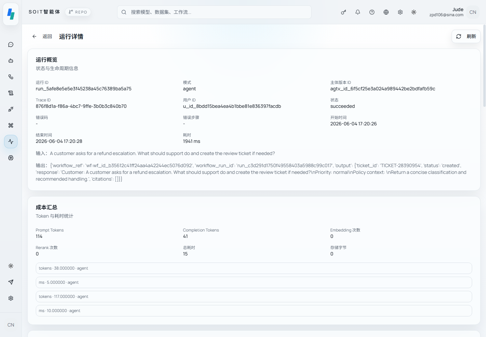

<div align="center">
  

  <h1>SOIT</h1>

  <p><strong>An Enterprise Platform for Orchestrating, Building, and Running Agents.</strong></p>

  <p>
    <code>Build</code> &nbsp;·&nbsp; <code>Execute</code> &nbsp;·&nbsp; <code>Observe</code> &nbsp;·&nbsp; <code>Control</code>
  </p>

  <p>
    <a href="https://github.com/soit-ai/soit/blob/main/LICENSE"></a>
    <a href="https://github.com/soit-ai/soit/stargazers"></a>
    <a href="https://github.com/soit-ai/soit/actions"></a>
    <a href="https://discord.gg/soit"></a>
    <a href="https://github.com/soit-ai/soit/blob/main/CONTRIBUTING.md"></a>
  </p>

  <p>
    <a href="#quick-start">Quick start</a> &nbsp;·&nbsp;
    <a href="#architecture">Architecture</a> &nbsp;·&nbsp;
    <a href="https://docs.soit.ai">Documentation</a> &nbsp;·&nbsp;
    <a href="#roadmap">Roadmap</a> &nbsp;·&nbsp;
    <a href="./README.zh-CN.md">中文</a>
  </p>
</div>

<br />

<p align="center">
  
</p>

<br />

## What is SOIT?

SOIT is an open-source platform for **building, running, and governing AI agents in production**. It combines the flexibility of a modern agent framework with the discipline of enterprise infrastructure: multi-tenant by default, event-driven at the core, and audit-ready out of the box.

Most agent platforms stop at "make a chatbot work." SOIT is built for the harder problem — making agents reliable enough that your CIO will sign off on them touching real systems.

If you have ever shipped an agent prototype and then discovered you also need permissions, multi-tenancy, retries, traces, evaluations, secret management, and a way to explain failures to a compliance officer — SOIT is built for you.

## Why SOIT?

|                                  | Notebook frameworks | Hosted agent products | Cloud-vendor agents | **SOIT**            |
| -------------------------------- | :-----------------: | :-------------------: | :-----------------: | :-----------------: |
| Multi-tenant isolation           | —                   | partial               | yes                 | **first-class**     |
| Model-neutral routing            | yes                 | partial               | vendor-locked       | **first-class**     |
| Workflow + Agent dual model      | partial             | one or the other      | partial             | **both, equal**     |
| Audit-ready execution ledger     | —                   | partial               | partial             | **built-in**        |
| Self-hosted, single command      | yes                 | —                     | —                   | **yes**             |
| Spec-first contracts             | —                   | —                     | —                   | **every primitive** |

SOIT is the platform we wished we had when our agents graduated from notebooks to production.

## The four pillars

SOIT is organized around four capabilities. Each is a first-class citizen, designed to be used independently or composed together.

### Build — Assemble agents from typed capabilities

Compose agents from a unified capability registry: models, knowledge bases, workflows, skills, and tools. Every binding is typed, versioned, and source-agnostic — a tool from a plugin, an MCP server, or a built-in adapter looks identical from the agent's perspective.

- Visual agent assembly console with versioning and release management
- DAG workflow editor with 18+ node types — LLM, tool, condition, loop, transform, knowledge search, code execution, parameter extraction, and more
- Knowledge ingestion pipeline for PDF, DOCX, Markdown, and HTML, with chunking, embedding, and Milvus-backed retrieval
- MCP-friendly: any Model Context Protocol server resolves into the runtime tool registry without code changes

### Execute — Run with reliability and reproducibility

Every execution — chat turn, agent loop, or workflow run — flows through the same runtime ledger. Outbox-pattern event dispatch guarantees that no state change is lost and no side effect is duplicated.

- Unified `Run / Task / RunStep / Trace` ledger across all execution types
- Outbox-based event-driven runtime with checkpoints and idempotency
- Multi-model routing across OpenAI, Anthropic, DeepSeek, Qwen, and any OpenAI-compatible endpoint
- Cost-aware execution with per-step token and latency accounting
- Graceful failure handling with retries, fallback chains, and human-in-the-loop approvals

### Observe — Workspace-level visibility, not just request logs

Most platforms give you a list of runs. SOIT gives you a **workspace control console** built directly on the runtime ledger.

- Live workspace summary: active agents, run volume, cost burn, failure rate
- Drill-down by agent, by workflow, by tool, and by source (`source_kind=plugin | mcp | builtin`)
- Trace timeline with full step replay
- Knowledge retrieval quality metrics
- OpenTelemetry-compatible tracing, structured JSON logs, and Prometheus metrics

### Control — Govern access, secrets, and execution boundaries

Enterprise platforms live and die by what they refuse to do. SOIT treats governance as a kernel concern, not an afterthought.

- Tenant and workspace scoping enforced at every API and data layer
- RBAC with resource-level permissions and grant inheritance
- Vault-backed secret management with workspace-scoped visibility
- Egress policy enforcement for outbound HTTP calls
- Per-version capability allowlists for every agent
- Full audit log of every privileged operation

## Quick start

The fastest way to try SOIT locally:

```bash
git clone https://github.com/soit-ai/soit.git
cd soit
cp .env.example .env
docker compose up -d
```

Then open `http://localhost:5000` and sign in with the bootstrap admin credentials from your `.env` file.

What you get on first launch:

- Web UI on `:5000`, API on `:9200`
- PostgreSQL, Redis, Milvus, MinIO, and Vault all wired and healthy
- Database migrations applied automatically
- A sample agent, workflow, and knowledge base pre-loaded so you can click around immediately

For a local development setup with hot reload (Python and Node), see [docs/development.md](./docs/development.md).

## Architecture

SOIT follows a strict hexagonal architecture: a stable kernel at the center, replaceable adapters at the edges, and domain modules in between.

```
┌─────────────────────────────────────────────────────────────┐
│  API Layer  —  REST · WebSocket · SSE                       │
├─────────────────────────────────────────────────────────────┤
│  Kernel  (stable core)                                      │
│    Runtime · Identity · Trace · Specs · Security            │
│    Events · Responses · Observability · Registry            │
│    Ports:  LLM · Tools · Vector · Storage · Secrets         │
├─────────────────────────────────────────────────────────────┤
│  Domain Modules                                             │
│    Agent · Workflow · Knowledge · Skill · Plugin · MCP      │
├─────────────────────────────────────────────────────────────┤
│  Adapters                                                   │
│    OpenAI · Anthropic · DeepSeek · Milvus · MinIO · Vault   │
├─────────────────────────────────────────────────────────────┤
│  Infrastructure                                             │
│    PostgreSQL · Redis · Milvus · MinIO · Celery             │
└─────────────────────────────────────────────────────────────┘
```

Five principles govern every design decision in SOIT:

1. **Spec-First.** Every primitive — Agent, Workflow, Tool, Knowledge, Plugin — has a versioned JSON Schema that contracts both API and storage layers.
2. **Scope-By-Default.** Every resource carries a `tenant_id` and `workspace_id`. No exceptions, no escape hatches.
3. **Trace Everything.** Every execution creates a `Run` with structured `RunSteps`. There are no silent operations.
4. **Gateway-Only.** External calls go through governed gateways. Business code never opens a raw HTTP client or LLM SDK.
5. **Immutable Versions.** Versions are append-only. Releases move pointers, never mutate history.

For the full architecture deep-dive, see [server/docs/architecture/README.md](./server/docs/architecture/README.md).

## Use cases

SOIT is designed for teams who need agents to do real work in production:

- **Internal copilots** — RAG-powered assistants over private documentation, with permission inheritance from your existing IAM
- **Workflow automation** — Long-running, retry-safe agent workflows with human approval steps and full audit trails
- **Customer-facing AI features** — Multi-tenant agent serving with per-customer isolation, quotas, and cost attribution
- **Compliance-sensitive AI** — Agents in regulated environments where every model call must be explainable and every secret must be vaulted
- **Multi-model strategies** — Cost-optimized routing across providers, with graceful fallback and per-model performance tracking

## Tech stack

| Layer        | Choices                                                                  |
| ------------ | ------------------------------------------------------------------------ |
| Backend      | Python 3.11 · FastAPI · SQLModel · Alembic · Celery · OpenTelemetry      |
| Frontend     | TypeScript · React Router 7 · TailwindCSS 4 · Zustand · React Query · React Flow |
| Data         | PostgreSQL 15 · Redis 7 · Milvus 2.5 · MinIO                             |
| Security     | HashiCorp Vault · JWT · bcrypt                                           |
| LLM          | OpenAI · Anthropic · DeepSeek · Qwen · LangChain (adapter layer)         |

## Roadmap

We ship in tight, themed iterations. The current focus areas:

- [x] Outbox-based event-driven runtime (Wave A and B)
- [x] Capability registry with source-agnostic tool binding
- [x] Agent versioning and release management
- [x] Hexagonal kernel with strict port-adapter boundaries
- [ ] Workspace observability console — *in progress*
- [ ] Agent evaluation framework with regression testing
- [ ] MCP marketplace for one-click tool installation
- [ ] Cost-aware multi-model routing policies
- [ ] Approval workflows with human-in-the-loop checkpoints

See the full [roadmap](./docs/roadmap.md) and [open issues](https://github.com/soit-ai/soit/issues) to track progress and propose ideas.

## Contributing

We welcome contributions of all sizes. Before opening a PR:

1. Read [CONTRIBUTING.md](./CONTRIBUTING.md) for setup and code style
2. Browse existing issues — find one tagged `good first issue` if you are new
3. For larger changes, open a discussion first so we can align on direction

SOIT follows a `spec-first` development model: significant features begin as a written spec in `docs/specs/` before any code is written. We have found this catches design problems early and keeps the architecture coherent as the project grows.

## Community

- **GitHub Discussions** — questions, ideas, and show-and-tell
- **Discord** — real-time chat with maintainers and users
- **Twitter / X** — release announcements and product updates
- **Blog** — engineering deep-dives and customer case studies

## License

SOIT is released under the [Apache License 2.0](./LICENSE).

The core platform is and will remain open source. Some advanced enterprise features — SSO, advanced audit reports, SLA monitoring, multi-region deployment — are available in SOIT Enterprise.

---

<div align="center">
  <sub>Built with care for teams who run AI in production.</sub>
</div>