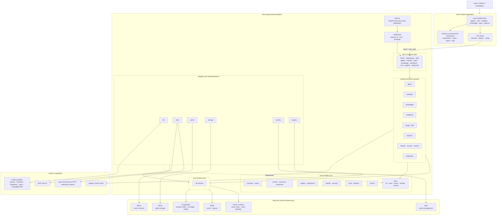
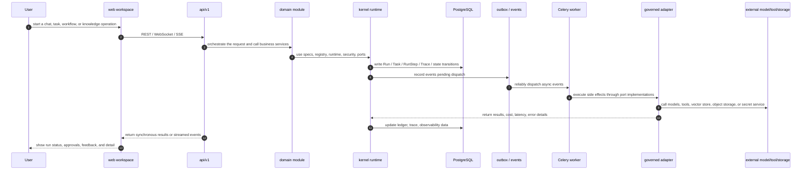
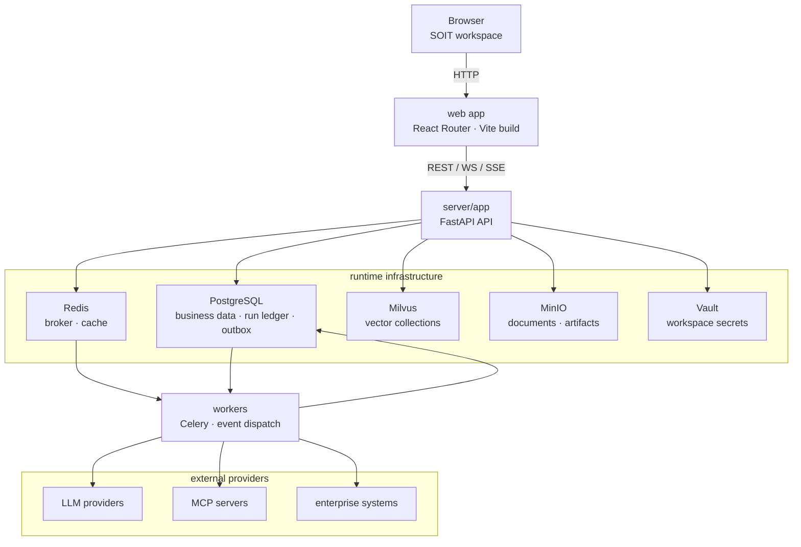
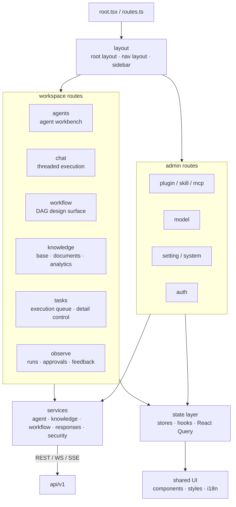
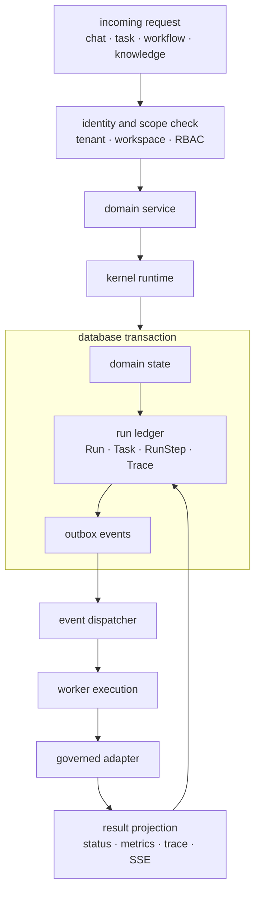
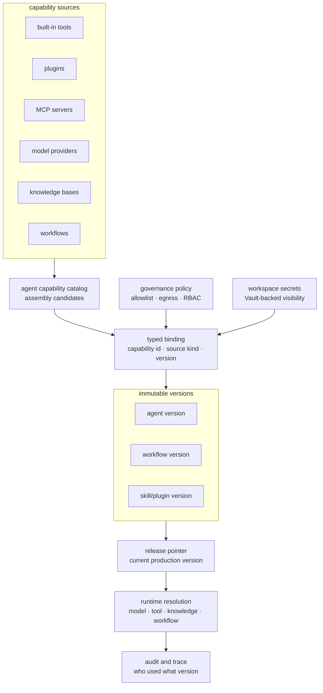

# SOIT Platform Architecture

This document summarizes the current SOIT platform architecture. The
boundaries in the diagrams come from the root `README.md`,
`server/docs/architecture/PROJECT_STRUCTURE.md`,
`web/docs/PROJECT_STRUCTURE.md`, and the current source tree.

## Platform Overview

## Core Execution Path

## Architecture Boundaries

- `web/` owns the user workspace, routes, state, and API clients; it carries
  no backend business rules.
- `api/` only handles HTTP, WebSocket, and SSE transport plus request
  orchestration, and stays thin.
- `modules/` carries the business domain logic for agent, workflow,
  knowledge, plugin, observe, and related domains.
- `kernel/` is the stable core defining contracts, specs, runtime, registry,
  security, events, and ports; `kernel/` does not depend on `modules/`.
  Execution and persistence state are concentrated in `kernel/runtime/`,
  where run traces belong to `runtime/runs/`.
- `adapters/` implements kernel ports and connects models, tools, the vector
  store, object storage, and secret systems; it contains no business logic.
- `infra/` provides infrastructure capabilities such as database sessions and
  the OpenTelemetry SDK/OTLP configuration.
- External calls must go through governed adapters/gateways; business code
  never calls model SDKs, HTTP clients, or external services directly.

## Design Principle Mapping

- Spec-first: platform primitives such as Agent, Workflow, Tool, Knowledge,
  and Plugin are constrained by versioned specs/contracts.
- Scope-by-default: the API, business domains, and data layer are organized
  around tenant/workspace scope.
- Trace everything: execution lands uniformly in Run, Task, RunStep, Cost,
  and observe data, and W3C Trace Context links API, Outbox, Knowledge
  Worker, database, HTTP, LLM, and Tool spans; `run_id`, `step_id`, and
  `trace_id` are the correlation keys between product audit and the technical
  call chain.
- Gateway-only: LLM, tool, vector, storage, and secrets access goes through
  ports/adapters.
- Immutable versions: agent, workflow, skill, and plugin versions are
  append-only, and release pointers express the currently published state.

## Deployment Topology

## Frontend Information Architecture

## Backend Boundary Diagram

## Runtime Event Diagram

## Capability and Version Governance

