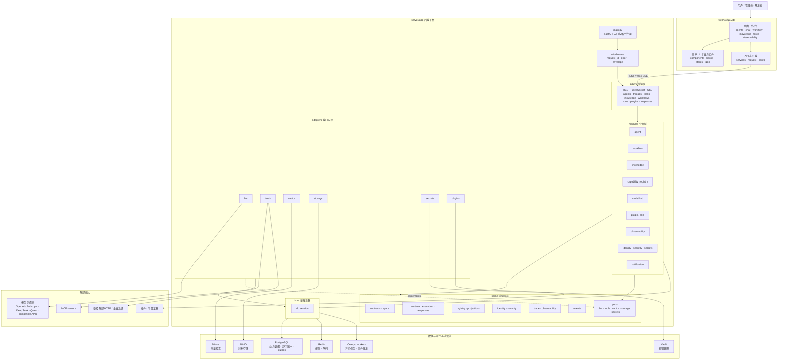
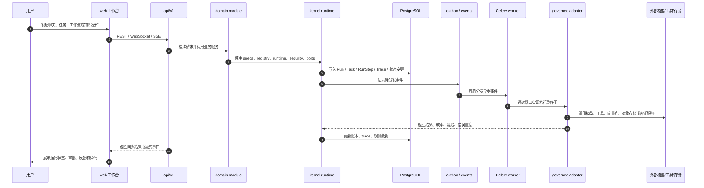
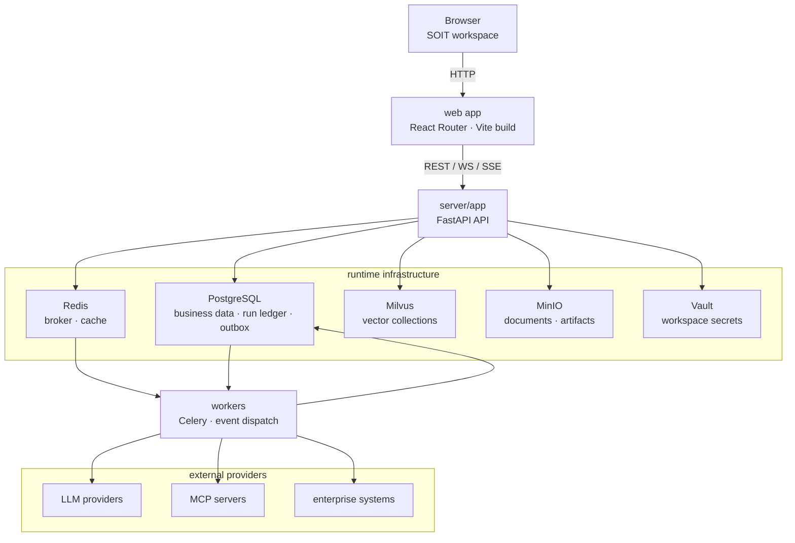
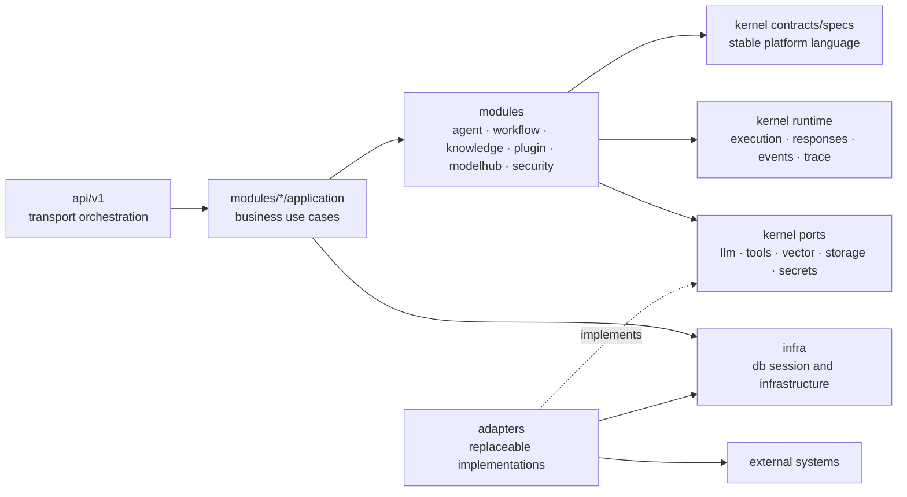
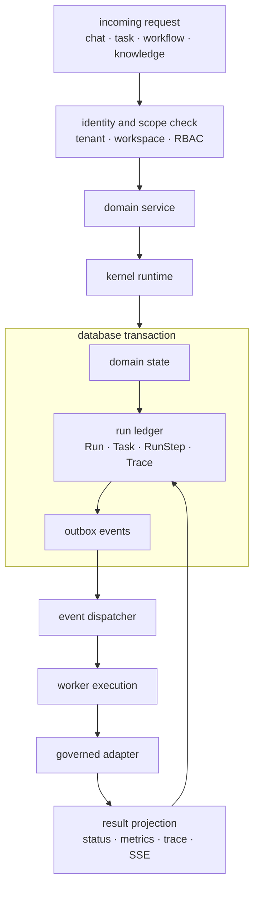

# SOIT 平台架构图

本文档汇总 SOIT-Pro 当前平台架构。图中边界来自根目录 `README.md`、`server/docs/architecture/PROJECT_STRUCTURE.md`、`web/docs/PROJECT_STRUCTURE.md` 以及当前源码目录。

## 平台总览

## 核心执行链路

## 架构边界

- `web/` 负责用户工作台、路由、状态和 API 客户端，不承载后端业务规则。
- `api/` 只做 HTTP、WebSocket、SSE 传输和请求编排，保持薄层。
- `modules/` 承载 agent、workflow、knowledge、plugin、observability 等业务域逻辑。
- `kernel/` 是稳定核心，定义 contracts、specs、runtime、registry、security、trace、events 和 ports；`kernel/` 不依赖 `modules/`。
- `adapters/` 实现 kernel ports，连接模型、工具、向量库、对象存储和密钥系统，不放业务逻辑。
- `infra/` 提供数据库会话等基础设施能力。
- 外部调用必须经由受治理的 adapters/gateways，业务代码不直接调用模型 SDK、HTTP 客户端或外部服务。

## 设计原则映射

- Spec-first: Agent、Workflow、Tool、Knowledge、Plugin 等平台原语由版本化 specs/contracts 约束。
- Scope-by-default: API、业务域和数据层围绕 tenant/workspace 作用域组织。
- Trace everything: 执行统一落到 Run、Task、RunStep、Trace 和 observability 数据。
- Gateway-only: LLM、tool、vector、storage、secrets 通过 ports/adapters 接入。
- Immutable versions: agent、workflow、skill、plugin 等版本追加写入，release 指针表达当前发布状态。

## 部署拓扑图

## 前端信息架构图

## 后端边界图

## 运行时事件图

## 能力与版本治理图

